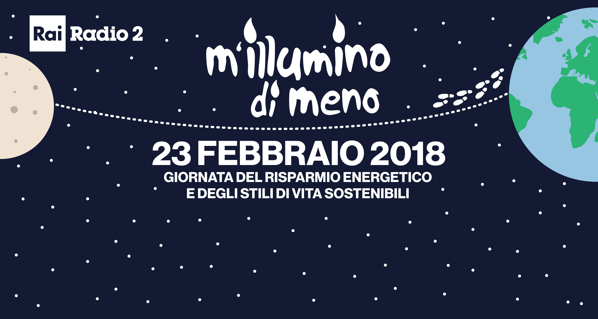

## M'illumino di Meno a Venezia

Per la prima volta anche il DVRI con i suoi soci ha aderito alla campagna "M'illumino di Meno"! L'iniziativa nazionale promossa da Caterpillar -Radio2 è sempre più radicata nel contesto veneziano a cui per la prima volta, guidati da Ca' Foscari Sostenibile, hanno partecipato attivamente anche le istituzioni veneziane e i centri di ricerca del network del DVRI per sostenere comportamenti a favore del risparmio energetico. 

## Ca' Foscari Sostenibile Capofila

<iframe width="560" height="315" src="https://www.youtube.com/embed/8GGLi_rt6sw" frameborder="0" allow="autoplay; encrypted-media" allowfullscreen></iframe>

Per il decimo anno consecutivo Ca' Foscari partecipa alla campagna nazionale "M'illumino di meno" per sensibilizzare tutta la comunità sui temi del risparmio energetico e della mobilità sostenibile, coinvolgendo per la prima volta diverse realtà del territorio veneziano tra cui il DVRI e IUAV  e rientrando tra le iniziative realizzate a livello di RUS - Rete delle Università per lo Sviluppo Sostenibile. 
L'edizione di quest'anno è stata incentrata sul tema della mobilità sostenibile, nello specifico sono stati incentivati gli spostamenti a piedi. Con questo proposito nella giornata del 22 febbraio è stata organizzata una camminata a piedi tra le sedi di Ca' Foscari e quelle dell'università IUAV. Non solo, tante sono state le iniziative proposte: dall'ora e mezza di silenzio energetico - durante la quale sono state spente simbolicamente le luci di tutte le sedi nella giornata di giovedì 22 febbraio e per la quale è stato quantificato il risparmio energetico nelle sedi di Ca' Foscari centrale e di San Giobbe, al quarto d'ora di silenzio energetico, dalla campagna social a favore dei comportamenti sostenibili alla call per la comunità cafoscarina di proporre idee per l'efficientamento energetico delle sedi universitarie.   

## La partecipazione delle organizzazioni culturali e di ricerca veneziane

I soci del DVRI hanno partecipato principalmente aderendo alla Campagna Social. Durante la settimana dal 19 al 23 febbraio, è stata realizzata una campagna di comunicazione sui principali social network di Ca' Foscari Sostenibile ( link Facebook e Twitter) per promuovere comportamenti sostenibili, attraverso consigli pratici da attuare quotidianamente nei propri uffici. Le istituzioni del DVRI hanno diffuso e sostenuto il messaggio di Ca' Foscari Sostenibile e come nel caso del CNR ISMAR, contribuito raccontando le proprie ricerche in merito. CO.RI.LA si è anche impegnato a spegnere le luci della propria sede. 
Le organizzazioni convolte sono state: Accademia di Belle Arti di Venezia; Centro Tedesco di Studi Veneziani; CNR ISMAR- Consiglio Nazionale Ricerche; CNR IDPA- Consiglio Nazionale Ricerche, Conservatorio di Musica Benedetto Marcello; CO.RI.LA Consorzio Ricerche Lagunari; Fondazione Bevilaqua La MasaFondazione Querini Stampalia Onlus; Fondazione Ugo e Olga Levi onlus; IRCCS Fondazione Ospedale San Camillo;Università Ca' Foscari Venezia; Venice Centre for Marine Science and Technologies

## M'illlumino di meno compie 14 anni 
![TORREDIPISA_MILLUMINODIMENO] 

Dall'inizio di M'illumino di Meno, in 14 anni, il mondo è cambiato. L'efficienza energetica è diventata un tema economico rilevante e le lampadine ad incandescenza che Caterpillar invitava a cambiare con quelle a risparmio energetico, adesso, semplicemente, non esistono più.
Un'iniziativa simbolica e concreta - spegnere le luci e testimoniare il proprio interesse al futuro dell'umanità - che è diventata subito molto partecipata: si spengono sempre le piazze italiane, i monumenti - la Torre di Pisa, il Colosseo, l'Arena di Verona -, i palazzi simbolo dell'Italia - Quirinale, Senato e Camera - e tante case dei cittadini.

